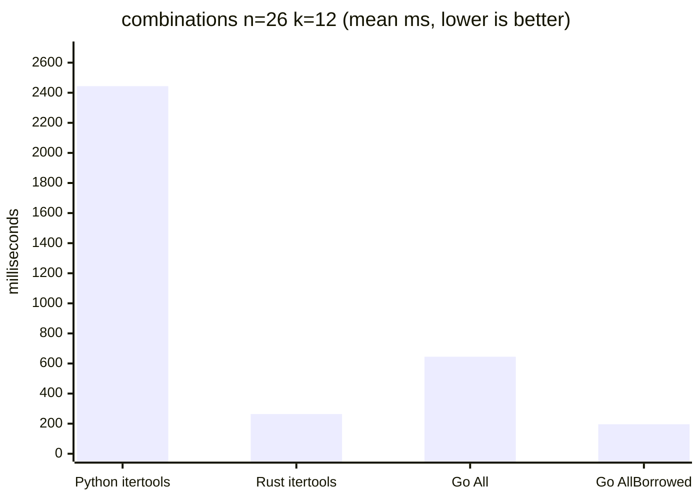
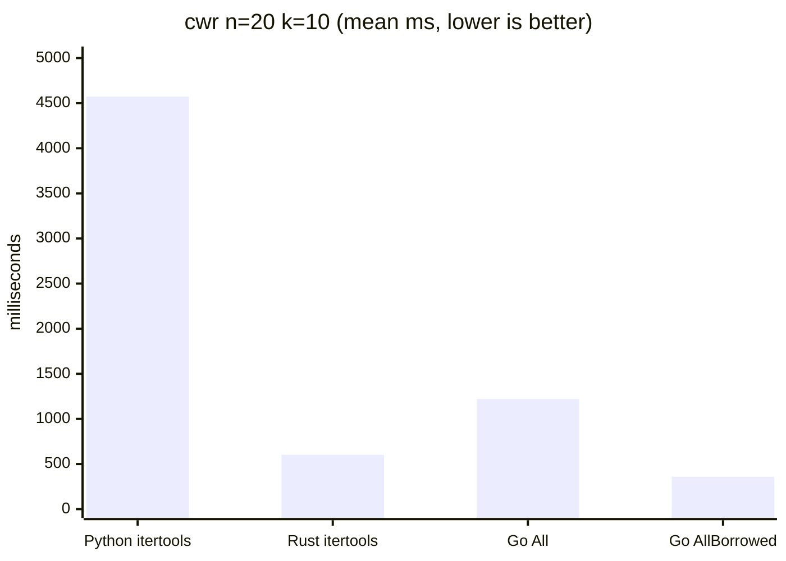
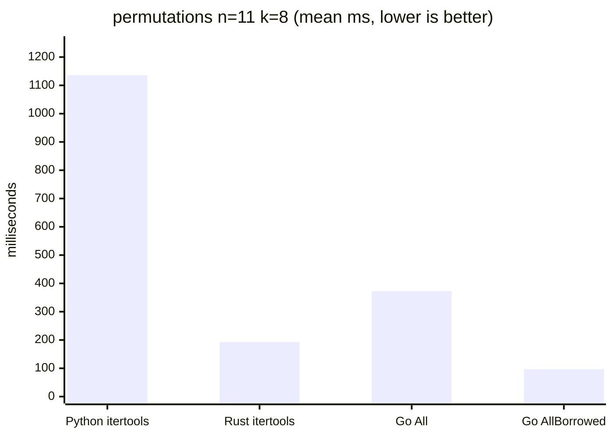
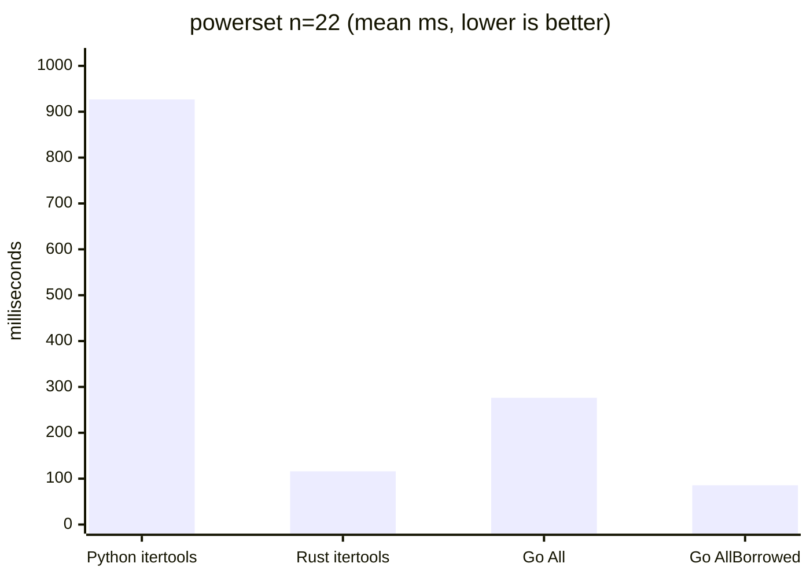
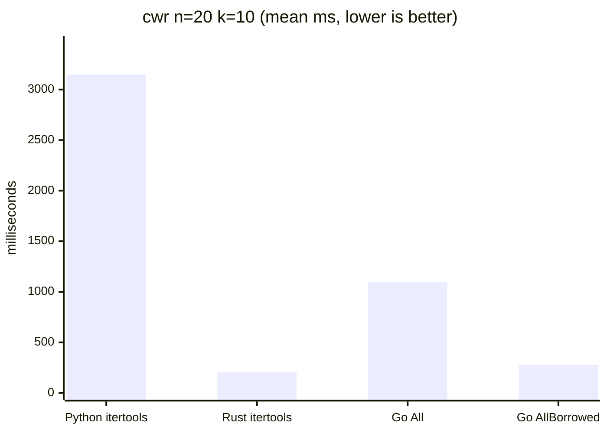
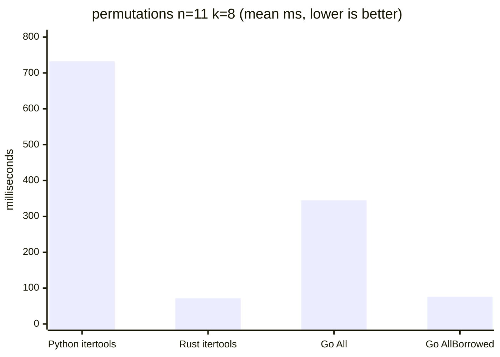
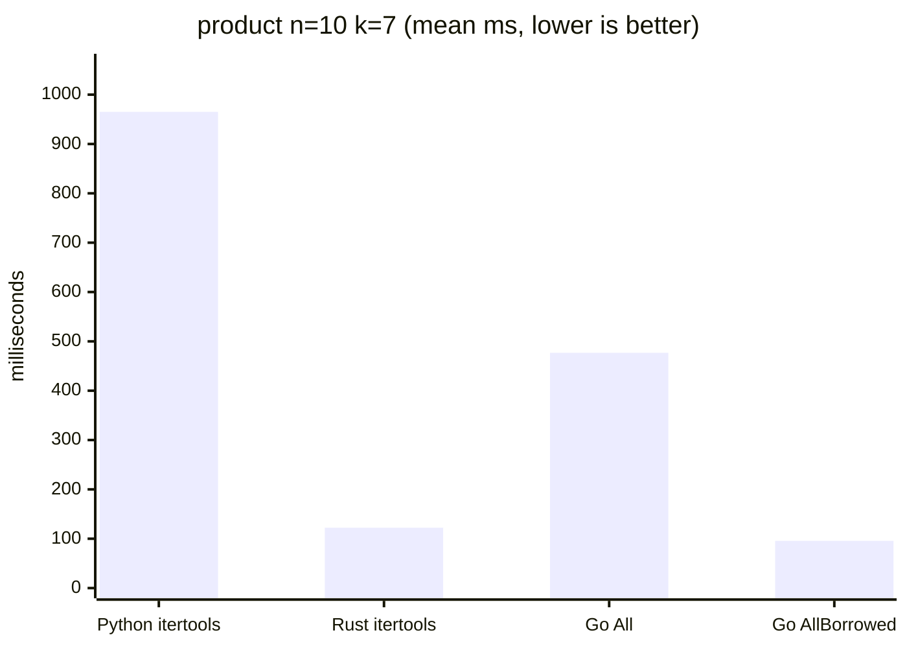
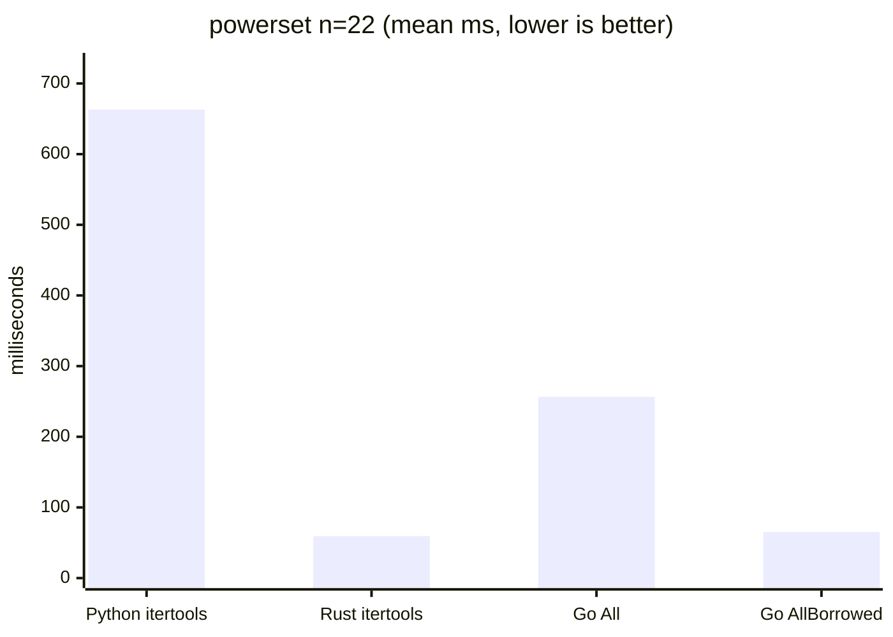

# Cross-language benchmark results

Whole-process wall-clock comparison of this Go library against Python's
stdlib `itertools` and the Rust `itertools` crate, measured with
[hyperfine](https://github.com/sharkdp/hyperfine). Generated by `bench/run.sh`.

Results are recorded per machine; re-running `bench/run.sh` regenerates a
single-machine report, so historical machines are preserved here by hand.

## Caveats

- **Apples-to-oranges allocation.** Go `All()`, Python `itertools`, and
  the Rust `itertools` crate all allocate a fresh tuple/Vec per item, so
  those three are the fair comparison. Go `AllBorrowed()` reuses an
  internal buffer and has no direct analog in the other two — it is the
  library's low-allocation fast path, shown here for reference.
- **Startup overhead.** A static Go/Rust binary starts far faster than the
  Python interpreter. Workloads are sized so iteration dominates; the
  Python startup floor below is the practical lower bound for the Python
  rows.
- Each driver iterates the full sequence and sum-accumulates every index
  (wrapping 64-bit) to defeat dead-code elimination; all drivers print the
  same accumulator for a given (op, n, k).

## Machine: Apple M1 Pro (Go 1.26.3)

Generated by `bench/run.sh` (2026-06-03T03:30:35Z).

### Versions

| Tool | Version |
|------|---------|
| Go | go1.26.3 |
| Python | 3.14.5 |
| Rust | 1.96.0 |
| itertools crate | 0.14.0 |
| hyperfine | 1.20.0 |

### Python startup floor

| Command | Mean [ms] | Min [ms] | Max [ms] | Relative |
|:---|---:|---:|---:|---:|
| `python3 -c pass` | 21.7 ± 1.3 | 20.1 | 28.0 | 1.00 |

### Workloads

#### combinations n=26 k=12

| Command | Mean [s] | Min [s] | Max [s] | Relative |
|:---|---:|---:|---:|---:|
| `Python itertools` | 2.444 ± 0.008 | 2.429 | 2.459 | 12.46 ± 0.11 |
| `Rust itertools` | 0.264 ± 0.001 | 0.262 | 0.267 | 1.35 ± 0.01 |
| `Go All()` | 0.645 ± 0.003 | 0.639 | 0.650 | 3.29 ± 0.03 |
| `Go AllBorrowed()` | 0.196 ± 0.002 | 0.194 | 0.200 | 1.00 |

#### cwr n=20 k=10

| Command | Mean [s] | Min [s] | Max [s] | Relative |
|:---|---:|---:|---:|---:|
| `Python itertools` | 4.572 ± 0.011 | 4.550 | 4.584 | 12.75 ± 0.07 |
| `Rust itertools` | 0.603 ± 0.003 | 0.597 | 0.606 | 1.68 ± 0.01 |
| `Go All()` | 1.220 ± 0.006 | 1.208 | 1.230 | 3.40 ± 0.02 |
| `Go AllBorrowed()` | 0.359 ± 0.002 | 0.357 | 0.363 | 1.00 |

#### permutations n=11 k=8

| Command | Mean [s] | Min [s] | Max [s] | Relative |
|:---|---:|---:|---:|---:|
| `Python itertools` | 1.136 ± 0.020 | 1.122 | 1.180 | 11.71 ± 0.25 |
| `Rust itertools` | 0.193 ± 0.004 | 0.190 | 0.203 | 1.99 ± 0.05 |
| `Go All()` | 0.373 ± 0.005 | 0.367 | 0.382 | 3.85 ± 0.07 |
| `Go AllBorrowed()` | 0.097 ± 0.001 | 0.095 | 0.100 | 1.00 |

#### product n=10 k=7

| Command | Mean [s] | Min [s] | Max [s] | Relative |
|:---|---:|---:|---:|---:|
| `Python itertools` | 1.563 ± 0.016 | 1.549 | 1.603 | 12.28 ± 0.13 |
| `Rust itertools` | 0.247 ± 0.002 | 0.245 | 0.253 | 1.94 ± 0.02 |
| `Go All()` | 0.494 ± 0.003 | 0.489 | 0.500 | 3.88 ± 0.03 |
| `Go AllBorrowed()` | 0.127 ± 0.000 | 0.126 | 0.128 | 1.00 |

#### powerset n=22

| Command | Mean [ms] | Min [ms] | Max [ms] | Relative |
|:---|---:|---:|---:|---:|
| `Python itertools` | 926.7 ± 2.0 | 925.0 | 931.9 | 10.82 ± 0.11 |
| `Rust itertools` | 116.0 ± 0.6 | 114.7 | 117.5 | 1.35 ± 0.02 |
| `Go All()` | 276.4 ± 2.3 | 272.7 | 280.8 | 3.23 ± 0.04 |
| `Go AllBorrowed()` | 85.6 ± 0.8 | 84.4 | 87.5 | 1.00 |

## Machine: Intel i7-14700F (Go 1.26.3)

Generated by `bench/run.sh` (2026-06-03T03:36:49Z).

### Versions

| Tool | Version |
|------|---------|
| Go | go1.26.3 |
| Python | 3.14.5 |
| Rust | 1.96.0 |
| itertools crate | 0.14.0 |
| hyperfine | 1.20.0 |

### Python startup floor

| Command | Mean [ms] | Min [ms] | Max [ms] | Relative |
|:---|---:|---:|---:|---:|
| `python3 -c pass` | 8.8 ± 1.0 | 7.0 | 11.0 | 1.00 |

### Workloads

#### combinations n=26 k=12

| Command | Mean [s] | Min [s] | Max [s] | Relative |
|:---|---:|---:|---:|---:|
| `Python itertools` | 1.705 ± 0.012 | 1.688 | 1.724 | 13.23 ± 0.25 |
| `Rust itertools` | 0.129 ± 0.002 | 0.126 | 0.134 | 1.00 |
| `Go All()` | 0.571 ± 0.018 | 0.551 | 0.618 | 4.43 ± 0.16 |
| `Go AllBorrowed()` | 0.152 ± 0.004 | 0.147 | 0.160 | 1.18 ± 0.04 |

#### cwr n=20 k=10

| Command | Mean [s] | Min [s] | Max [s] | Relative |
|:---|---:|---:|---:|---:|
| `Python itertools` | 3.147 ± 0.045 | 3.110 | 3.219 | 15.44 ± 0.39 |
| `Rust itertools` | 0.204 ± 0.004 | 0.198 | 0.212 | 1.00 |
| `Go All()` | 1.093 ± 0.021 | 1.062 | 1.126 | 5.36 ± 0.15 |
| `Go AllBorrowed()` | 0.280 ± 0.004 | 0.275 | 0.287 | 1.37 ± 0.03 |

#### permutations n=11 k=8

| Command | Mean [ms] | Min [ms] | Max [ms] | Relative |
|:---|---:|---:|---:|---:|
| `Python itertools` | 732.2 ± 4.6 | 724.9 | 739.4 | 10.21 ± 0.30 |
| `Rust itertools` | 71.7 ± 2.0 | 69.2 | 78.5 | 1.00 |
| `Go All()` | 344.7 ± 5.7 | 336.1 | 354.6 | 4.81 ± 0.16 |
| `Go AllBorrowed()` | 76.0 ± 2.8 | 71.9 | 83.2 | 1.06 ± 0.05 |

#### product n=10 k=7

| Command | Mean [ms] | Min [ms] | Max [ms] | Relative |
|:---|---:|---:|---:|---:|
| `Python itertools` | 965.1 ± 4.4 | 959.4 | 973.2 | 10.08 ± 0.38 |
| `Rust itertools` | 122.3 ± 1.5 | 120.3 | 126.1 | 1.28 ± 0.05 |
| `Go All()` | 476.8 ± 11.0 | 457.9 | 495.7 | 4.98 ± 0.22 |
| `Go AllBorrowed()` | 95.7 ± 3.5 | 91.9 | 103.9 | 1.00 |

#### powerset n=22

| Command | Mean [ms] | Min [ms] | Max [ms] | Relative |
|:---|---:|---:|---:|---:|
| `Python itertools` | 663.0 ± 4.3 | 656.6 | 669.3 | 11.14 ± 0.64 |
| `Rust itertools` | 59.5 ± 3.4 | 55.0 | 66.9 | 1.00 |
| `Go All()` | 256.4 ± 6.6 | 247.0 | 266.4 | 4.31 ± 0.27 |
| `Go AllBorrowed()` | 65.2 ± 3.0 | 60.6 | 71.9 | 1.10 ± 0.08 |
