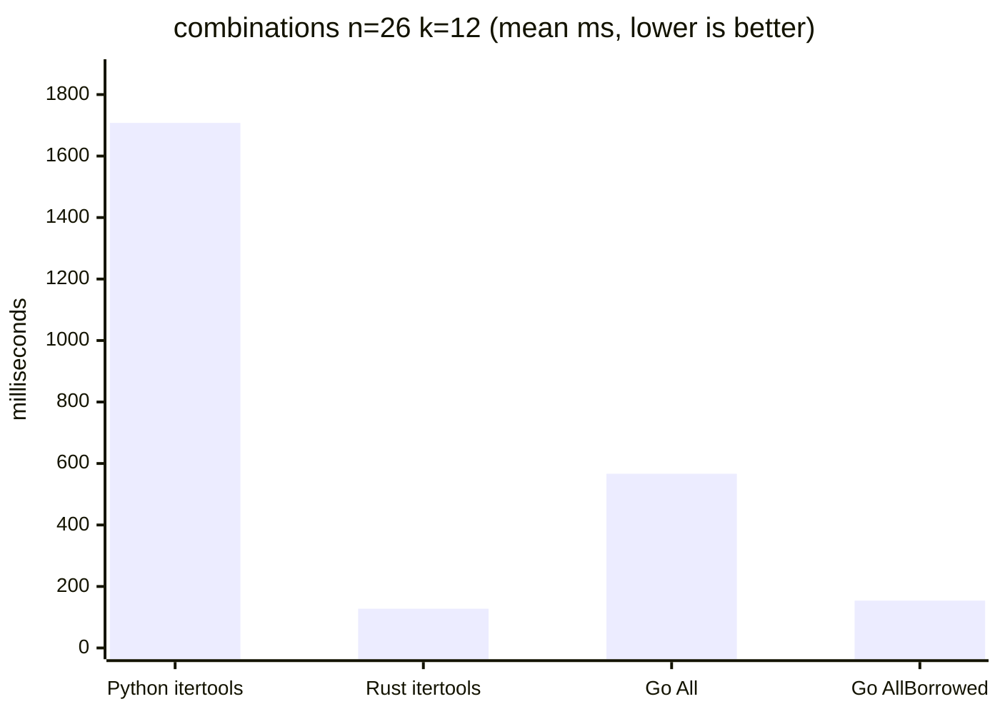
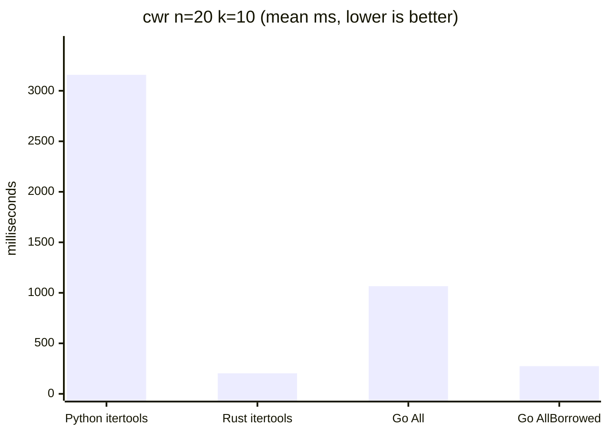
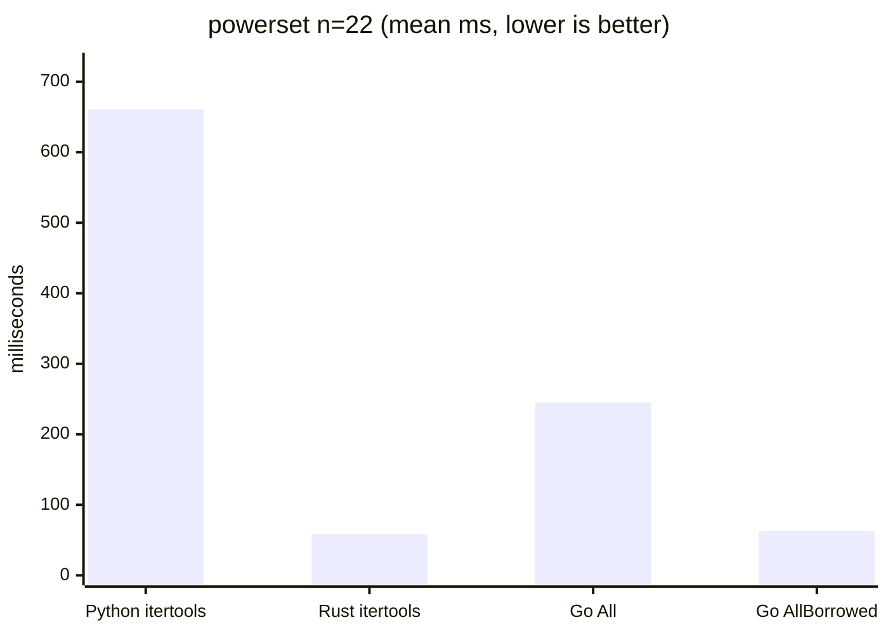

# Cross-language benchmark results

Whole-process wall-clock comparison of this Go library against Python's
stdlib `itertools` and the Rust `itertools` crate, measured with
[hyperfine](https://github.com/sharkdp/hyperfine). Generated by
`bench/run.sh` (2026-06-03T02:29:02Z).

## Versions

| Tool | Version |
|------|---------|
| Go | go1.24.0 |
| Python | 3.14.5 |
| Rust | 1.96.0 |
| itertools crate | 0.14.0 |
| hyperfine | 1.20.0 |

## Caveats

- **Apples-to-oranges allocation.** Go `All()`, Python `itertools`, and
  the Rust `itertools` crate all allocate a fresh tuple/Vec per item, so
  those three are the fair comparison. Go `AllBorrowed()` reuses an
  internal buffer and has no direct analog in the other two — it is the
  library's low-allocation fast path, shown here for reference.
- **Startup overhead.** A static Go/Rust binary starts far faster than the
  Python interpreter. Workloads are sized so iteration dominates; the
  Python startup floor below is the practical lower bound for the Python
  rows.
- Each driver iterates the full sequence and sum-accumulates every index
  (wrapping 64-bit) to defeat dead-code elimination; all drivers print the
  same accumulator for a given (op, n, k).

### Python startup floor

| Command | Mean [ms] | Min [ms] | Max [ms] | Relative |
|:---|---:|---:|---:|---:|
| `python3 -c pass` | 8.9 ± 1.2 | 6.9 | 11.3 | 1.00 |

## Workloads

### combinations n=26 k=12

| Command | Mean [s] | Min [s] | Max [s] | Relative |
|:---|---:|---:|---:|---:|
| `Python itertools` | 1.708 ± 0.010 | 1.697 | 1.731 | 13.37 ± 0.33 |
| `Rust itertools` | 0.128 ± 0.003 | 0.124 | 0.136 | 1.00 |
| `Go All()` | 0.567 ± 0.011 | 0.547 | 0.581 | 4.44 ± 0.14 |
| `Go AllBorrowed()` | 0.154 ± 0.004 | 0.149 | 0.160 | 1.21 ± 0.04 |

### cwr n=20 k=10

| Command | Mean [s] | Min [s] | Max [s] | Relative |
|:---|---:|---:|---:|---:|
| `Python itertools` | 3.158 ± 0.078 | 3.094 | 3.374 | 15.55 ± 0.50 |
| `Rust itertools` | 0.203 ± 0.004 | 0.197 | 0.213 | 1.00 |
| `Go All()` | 1.066 ± 0.019 | 1.040 | 1.115 | 5.25 ± 0.14 |
| `Go AllBorrowed()` | 0.274 ± 0.005 | 0.270 | 0.287 | 1.35 ± 0.04 |

### permutations n=11 k=8

| Command | Mean [ms] | Min [ms] | Max [ms] | Relative |
|:---|---:|---:|---:|---:|
| `Python itertools` | 738.1 ± 5.8 | 732.3 | 751.2 | 10.16 ± 0.42 |
| `Rust itertools` | 72.7 ± 2.9 | 69.1 | 80.2 | 1.00 |
| `Go All()` | 323.1 ± 12.1 | 310.8 | 350.1 | 4.45 ± 0.25 |
| `Go AllBorrowed()` | 75.8 ± 2.1 | 73.4 | 82.8 | 1.04 ± 0.05 |

### product n=10 k=7

| Command | Mean [ms] | Min [ms] | Max [ms] | Relative |
|:---|---:|---:|---:|---:|
| `Python itertools` | 972.6 ± 5.6 | 966.7 | 984.5 | 9.19 ± 0.36 |
| `Rust itertools` | 123.2 ± 1.7 | 120.7 | 125.8 | 1.16 ± 0.05 |
| `Go All()` | 467.8 ± 8.5 | 454.6 | 480.7 | 4.42 ± 0.19 |
| `Go AllBorrowed()` | 105.8 ± 4.0 | 100.3 | 114.6 | 1.00 |

### powerset n=22

| Command | Mean [ms] | Min [ms] | Max [ms] | Relative |
|:---|---:|---:|---:|---:|
| `Python itertools` | 661.1 ± 4.2 | 656.4 | 667.1 | 11.26 ± 0.74 |
| `Rust itertools` | 58.7 ± 3.9 | 54.8 | 66.9 | 1.00 |
| `Go All()` | 245.2 ± 10.7 | 233.1 | 261.4 | 4.18 ± 0.33 |
| `Go AllBorrowed()` | 62.9 ± 3.8 | 57.8 | 69.4 | 1.07 ± 0.10 |
