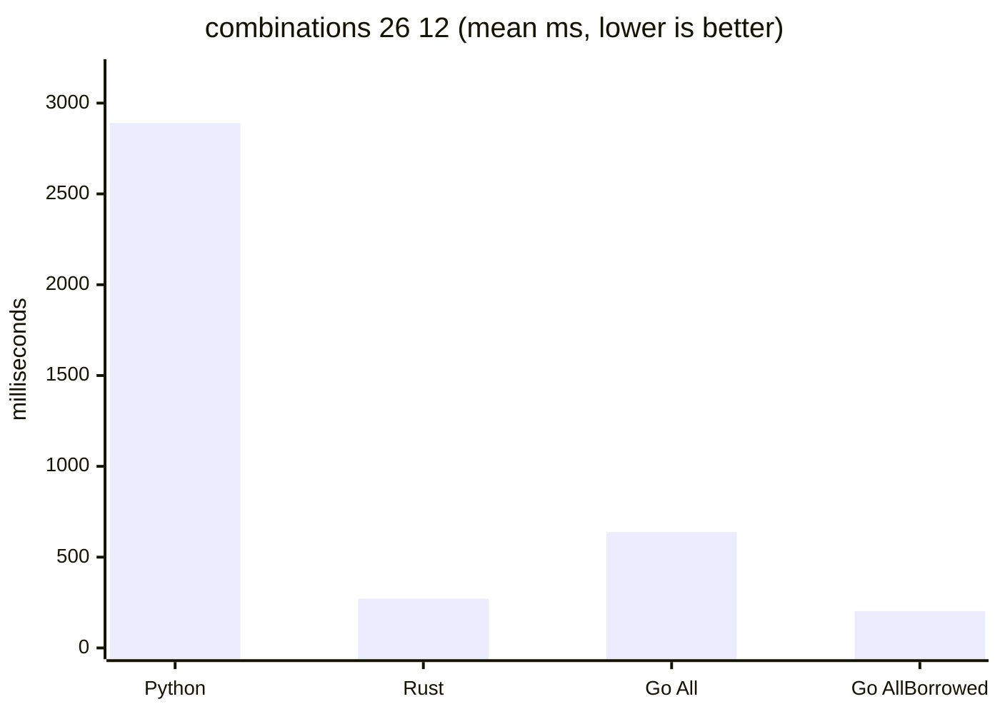
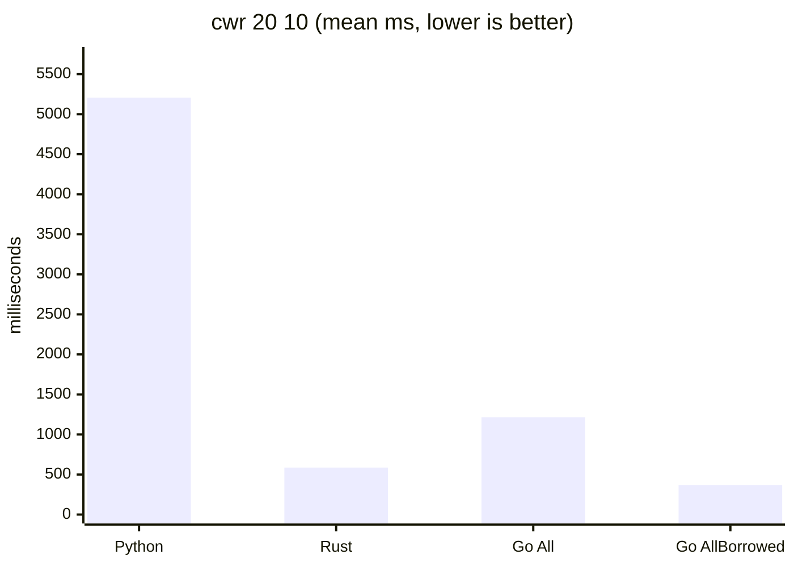
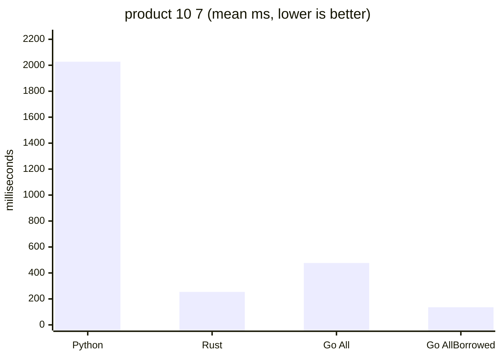
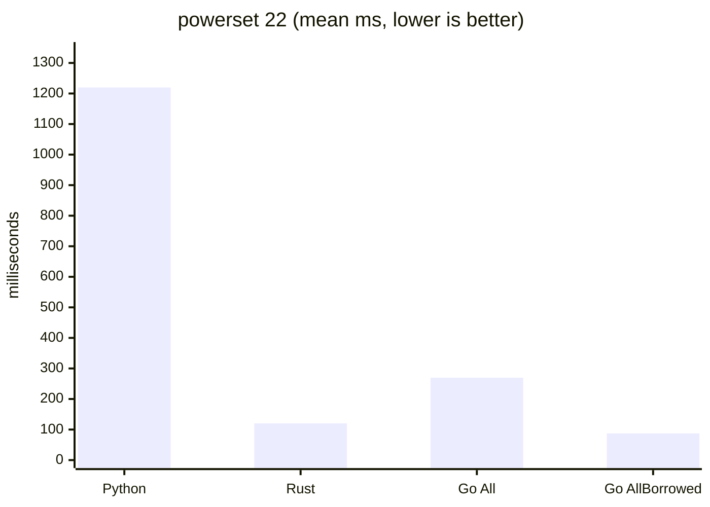
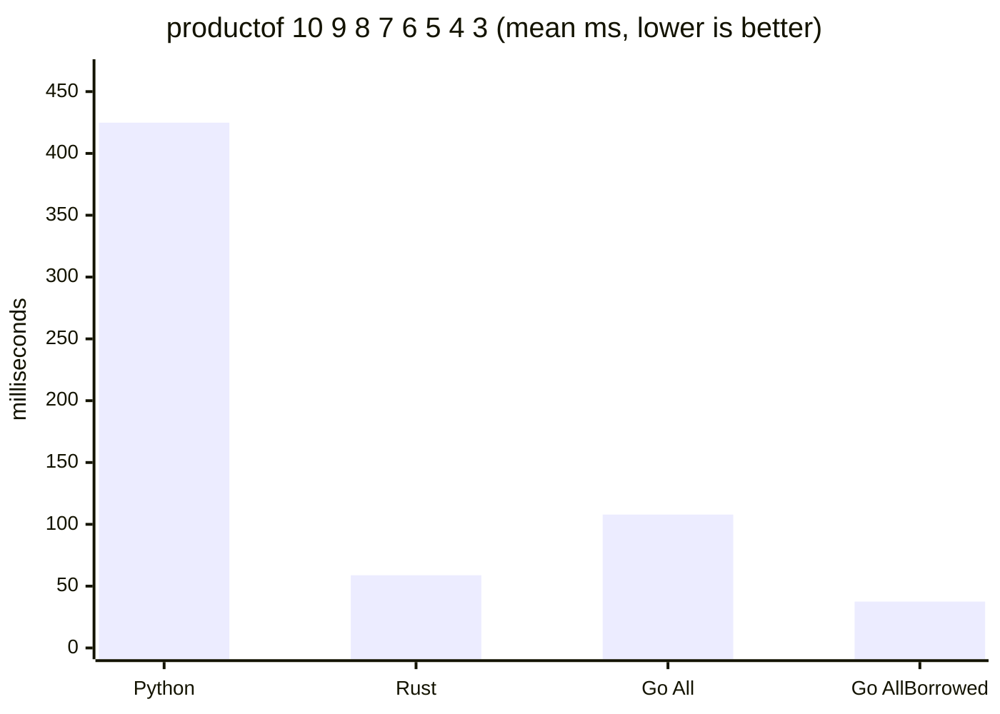
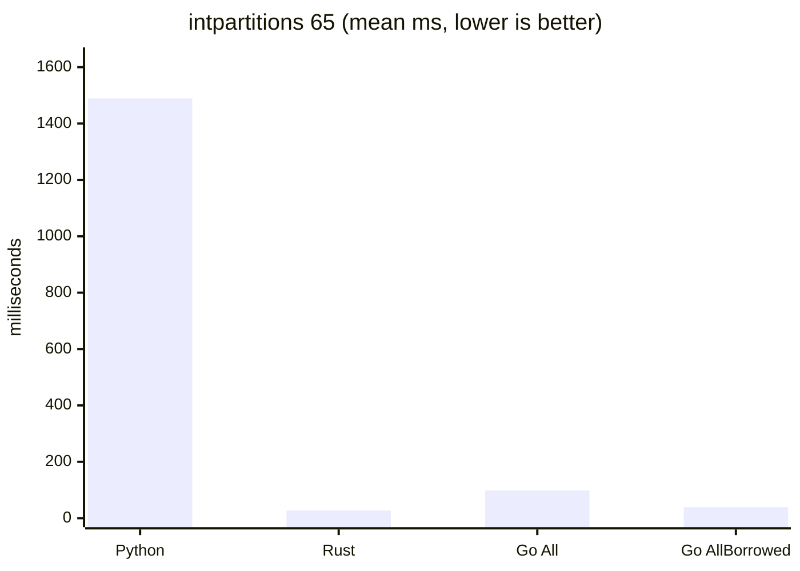
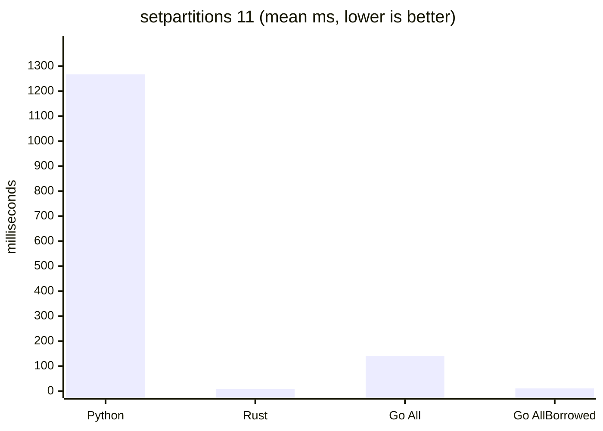

# Cross-language benchmark results

Whole-process wall-clock comparison of this Go library against Python's
stdlib `itertools` and the Rust `itertools` crate, measured with
[hyperfine](https://github.com/sharkdp/hyperfine). Generated by
`bench/run.sh` (2026-06-10T02:53:32Z).

## Versions

| Tool | Version |
|------|---------|
| Go | go1.26.4 |
| Python | 3.12.4 |
| Rust | 1.96.0 |
| itertools crate | 0.14.0 |
| sympy | 1.14.0 |
| more-itertools | 11.1.0 |
| hyperfine | 1.20.0 |

## Caveats

- **Apples-to-oranges allocation.** Go `All()`, Python `itertools`, and
  the Rust `itertools` crate all allocate a fresh tuple/Vec per item, so
  those three are the fair comparison. Go `AllBorrowed()` reuses an
  internal buffer and has no direct analog in the other two — it is the
  library's low-allocation fast path, shown here for reference.
- **Partitions have no itertools analog.** For `intpartitions` Python
  uses `sympy` and for `setpartitions` it uses `more-itertools`; the
  Rust `itertools` crate has neither, so the Rust rows for those two
  workloads are small hand-rolled generators mirroring this library's
  algorithms — they benchmark "what a Rust programmer would write",
  not an ecosystem library. The Rust setpartitions generator also only
  walks the block assignments (like Go `AllBorrowed()`), while Python
  more-itertools and Go `All()` materialize the blocks themselves.
- **Startup overhead.** A static Go/Rust binary starts far faster than the
  Python interpreter. Workloads are sized so iteration dominates; the
  Python startup floors below are the practical lower bounds for the
  Python rows (`import sympy` applies to the intpartitions row).
- Each driver iterates the full sequence and sum-accumulates a
  data-dependent value per item (wrapping 64-bit) to defeat dead-code
  elimination; all drivers print the same accumulator for a given
  workload. Index ops sum every index, intpartitions sums every part,
  and setpartitions sums `assignment[i] * i` over the canonical
  restricted-growth-string block assignment.

### Python startup floors

| Command | Mean [ms] | Min [ms] | Max [ms] | Relative |
|:---|---:|---:|---:|---:|
| `python -c pass` | 22.2 ± 0.9 | 21.1 | 25.9 | 1.00 |
| `python -c 'import sympy'` | 181.8 ± 13.7 | 169.7 | 219.9 | 8.18 ± 0.70 |

## Workloads

### combinations 26 12

| Command | Mean [s] | Min [s] | Max [s] | Relative |
|:---|---:|---:|---:|---:|
| `Python` | 2.890 ± 0.012 | 2.874 | 2.909 | 14.22 ± 0.13 |
| `Rust` | 0.271 ± 0.003 | 0.269 | 0.279 | 1.34 ± 0.02 |
| `Go All()` | 0.638 ± 0.012 | 0.626 | 0.653 | 3.14 ± 0.06 |
| `Go AllBorrowed()` | 0.203 ± 0.002 | 0.201 | 0.208 | 1.00 |

### cwr 20 10

| Command | Mean [s] | Min [s] | Max [s] | Relative |
|:---|---:|---:|---:|---:|
| `Python` | 5.205 ± 0.083 | 5.148 | 5.436 | 14.10 ± 0.23 |
| `Rust` | 0.586 ± 0.005 | 0.580 | 0.595 | 1.59 ± 0.01 |
| `Go All()` | 1.213 ± 0.010 | 1.201 | 1.231 | 3.29 ± 0.03 |
| `Go AllBorrowed()` | 0.369 ± 0.001 | 0.368 | 0.371 | 1.00 |

### permutations 11 8

| Command | Mean [s] | Min [s] | Max [s] | Relative |
|:---|---:|---:|---:|---:|
| `Python` | 1.494 ± 0.004 | 1.488 | 1.501 | 15.04 ± 0.09 |
| `Rust` | 0.222 ± 0.005 | 0.214 | 0.230 | 2.23 ± 0.05 |
| `Go All()` | 0.359 ± 0.002 | 0.357 | 0.362 | 3.62 ± 0.03 |
| `Go AllBorrowed()` | 0.099 ± 0.000 | 0.098 | 0.100 | 1.00 |

### product 10 7

| Command | Mean [s] | Min [s] | Max [s] | Relative |
|:---|---:|---:|---:|---:|
| `Python` | 2.027 ± 0.012 | 2.018 | 2.049 | 14.93 ± 1.08 |
| `Rust` | 0.254 ± 0.001 | 0.253 | 0.256 | 1.87 ± 0.14 |
| `Go All()` | 0.477 ± 0.003 | 0.474 | 0.483 | 3.51 ± 0.25 |
| `Go AllBorrowed()` | 0.136 ± 0.010 | 0.130 | 0.179 | 1.00 |

### powerset 22

| Command | Mean [s] | Min [s] | Max [s] | Relative |
|:---|---:|---:|---:|---:|
| `Python` | 1.220 ± 0.048 | 1.190 | 1.356 | 13.95 ± 0.57 |
| `Rust` | 0.120 ± 0.001 | 0.119 | 0.125 | 1.37 ± 0.02 |
| `Go All()` | 0.270 ± 0.001 | 0.268 | 0.271 | 3.08 ± 0.03 |
| `Go AllBorrowed()` | 0.087 ± 0.001 | 0.086 | 0.090 | 1.00 |

### productof 10 9 8 7 6 5 4 3

| Command | Mean [ms] | Min [ms] | Max [ms] | Relative |
|:---|---:|---:|---:|---:|
| `Python` | 424.9 ± 4.0 | 418.9 | 429.0 | 11.33 ± 0.31 |
| `Rust` | 58.8 ± 0.9 | 57.0 | 60.8 | 1.57 ± 0.05 |
| `Go All()` | 107.9 ± 1.2 | 105.9 | 111.4 | 2.88 ± 0.08 |
| `Go AllBorrowed()` | 37.5 ± 0.9 | 36.2 | 40.6 | 1.00 |

### intpartitions 65

| Command | Mean [s] | Min [s] | Max [s] | Relative |
|:---|---:|---:|---:|---:|
| `Python` | 1.489 ± 0.012 | 1.471 | 1.505 | 54.38 ± 7.17 |
| `Rust` | 0.027 ± 0.004 | 0.025 | 0.052 | 1.00 |
| `Go All()` | 0.099 ± 0.002 | 0.097 | 0.104 | 3.60 ± 0.48 |
| `Go AllBorrowed()` | 0.039 ± 0.001 | 0.038 | 0.041 | 1.43 ± 0.19 |

### setpartitions 11

| Command | Mean [s] | Min [s] | Max [s] | Relative |
|:---|---:|---:|---:|---:|
| `Python` | 1.267 ± 0.004 | 1.260 | 1.273 | 154.13 ± 4.31 |
| `Rust` | 0.008 ± 0.000 | 0.007 | 0.009 | 1.00 |
| `Go All()` | 0.140 ± 0.001 | 0.139 | 0.146 | 17.08 ± 0.51 |
| `Go AllBorrowed()` | 0.011 ± 0.001 | 0.010 | 0.014 | 1.31 ± 0.09 |
